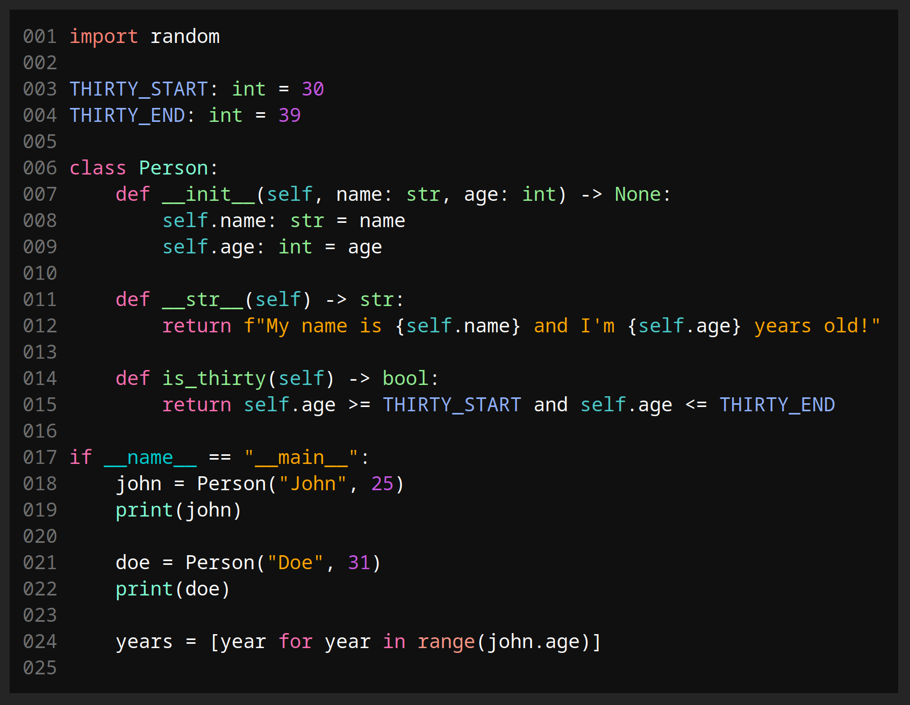

# HTML-Syntax

A simple syntax highlighter for Python and CSV files that generates static
HTML, built with Zig.

## Features
  * Compiles into static HTML
  * Highly extensible
  * Simple CLI
  * Highly customizable CSS
  * Python fstring highlighting
  * Python support for hex, octal, binary, and scientific notation

## Building
  * Download [Zig](https://ziglang.org)
  * Execute `zig build -Doptimize=ReleaseSafe`
  * Binary located in `zig-out/bin/`

## Usage
  * html\_coder **[OPTIONS...]** **[SOURCE FILE]** **[OUTPUT FILE]**
  * Use the `-t` option with **[python, csv]** to force a file type if required
  * Apply a stylesheet, example stylesheet: [style.css](examples/style.css)

## Example
  * [Python](examples/example.py) source file
  * [HTML](examples/example-python.html) result (stylying added manually)
  * [CSS](examples/style.css) used
  * [Screenshot](examples/example.png) Rendered with Firefox
